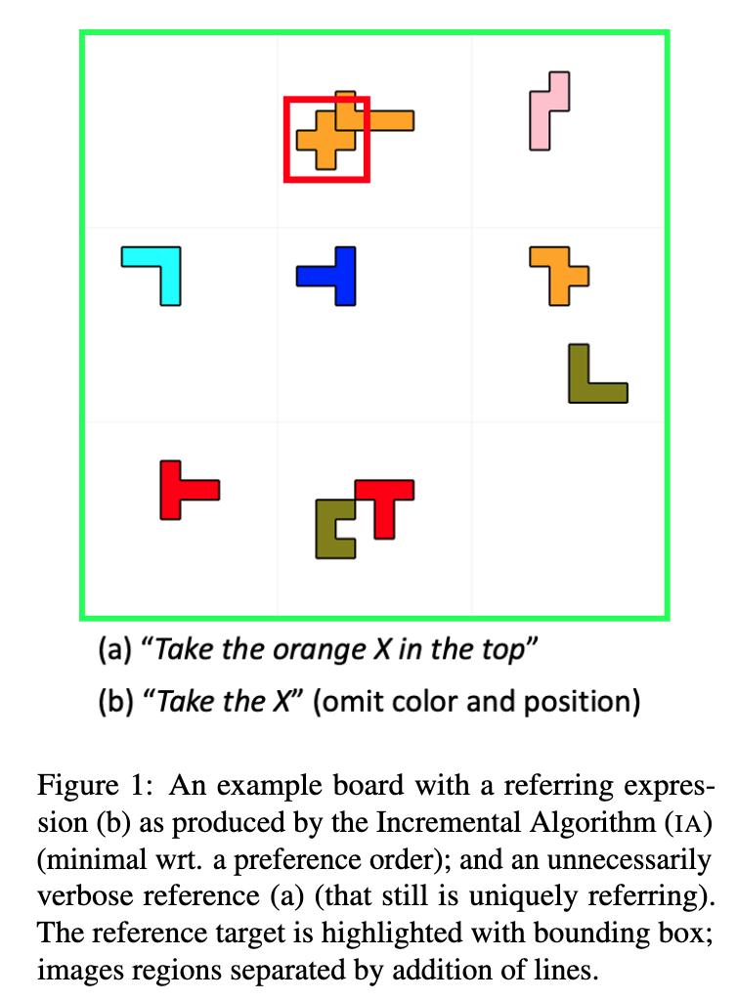
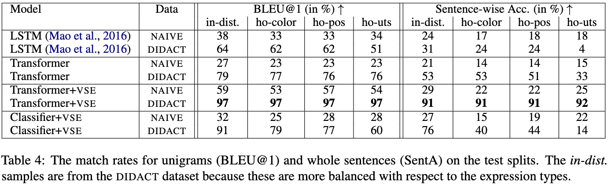

# Pento-DIARef: A Diagnostic Dataset for Learning the Incremental Algorithm for Referring Expression Generation from Examples

We present a **D**iagnostic dataset of **IA** **Ref**erences in a **Pento**mino domain (Pento-DIARef) that ties 
extensional and intensional definitions more closely together, insofar as the latter is the generative process
creating the former. 

We create a novel synthetic dataset of examples that pairs visual scenes with generated referring expressions; 
examine two variants of the dataset, representing two different ways to exemplify the
underlying task; and evaluate an LSTM-based baseline, a transformer and a modified version 
with region embeddings on them.

<p align="center">

</p>

## Abstract

> NLP tasks are typically defined extensionally through datasets containing example instantiations 
> (e.g., pairs of image _i_ and text _t_), but motivated intensionally through capabilities invoked 
> in verbal descriptions of the task (e.g., "_t_ is a description of _i_, for which the content of 
> _i_ needs to be recognised and understood"). We present Pento-DIARef, a diagnostic dataset in a 
> visual domain of puzzle pieces where referring expressions are generated by a well-known symbolic 
> algorithm (the "Incremental Algorithm"), which itself is motivated by appeal to a hypothesised 
> capability (eliminating distractors through application of Gricean maximes). Our question then 
> is whether the extensional description (the dataset) is sufficient for a neural model to pick 
> up the underlying regularity and exhibit this capability given the simple task definition of 
> producing expressions from visual inputs. We find that a model supported by a vision detection 
> step and a targeted data generation scheme achieves an almost perfect BLEU@1 score and sentence 
> accuracy, whereas simpler baselines do not.

## Results

<p align="center">

</p>

## Cite

```
@inproceedings{sadler-2023-pento-diaref,
    title = "Pento-DIARef: A Diagnostic Dataset for Learning the Incremental Algorithm for Referring Expression Generation from Examples",
    author = "Sadler, Philipp and Schlangen, David",
    booktitle = "Proceedings of the 17th Conference of the European Chapter of the Association for Computational Linguistics: Main Volume",
    month = "may",
    year = "2023",
    address = "Dubrovnik, Croatia",
    publisher = "Association for Computational Linguistics",
}
```

## Dataset Citation

```
@misc{sadler-2023-pento-diaref-dataset,
    title = "Pento-DIARef: A Diagnostic Dataset for Learning the Incremental Algorithm for Referring Expression Generation from Examples",
    author = "Sadler, Philipp and Schlangen, David",
    booktitle = "Proceedings of the 17th Conference of the European Chapter of the Association for Computational Linguistics: Main Volume",
    month = "may",
    year = "2023",
    address = "Dubrovnik, Croatia",
    publisher = "Association for Computational Linguistics",
    doi = "10.5281/zenodo.7625619",
    howpublished= "\url{https://doi.org/10.5281/zenodo.7625619}" 
}
```

# Reproduction

This section covers a step-by-step guide of how to use the provided scripts and sources.

## Preparation

Checkout the repository

Install the requirements:

```
pip install -r requirements.txt
```

For all commands we assume that you are in the top level project directory and executed in before:

```
source prepare_path.sh
```

## Data Generation

### Create the training and testing annotations for the `DIDACT` dataset

Create the data directory at a path of your choice.

```
mkdir -p /data/pento_diaref/didact
```

And copy the required files into the directory

```
cp resources/* /data/pento_diaref/didact
```

Then execute the script

```
python3 scripts/generate_annos_didactic.py \
    --data_dir /data/pento_diaref/didact \
    --train_num_sets_per_utterance_type 10 \
    --test_num_sets_per_utterance_type 1 \
    --gid_start 0 \
    --seed 42
```

This will create `148,400/10,000/10,000` in-distribution samples for training/validation/testing
and the `756/840/840` out-of-distribution (holdout target piece symbols) samples
for the color, position and utterance type generalization tests.

The script additionally filters out training samples where the extra target selection accidentally
produced a sample that has an utterance type reserved for the uts-holdout. So the remaining number
of in-distribution training samples is probably between 120k-130k.

Note: During training, we only use the in-distribution validation samples for model selection.

### Create the training and testing annotations for the `NAIVE` dataset

Create the data directory at a path of your choice.

```
mkdir -p /data/pento_diaref/naive
```

And copy the required files into the directory

```
cp resources/* /data/pento_diaref/naive
```

Then execute the script

```
python3 scripts/generate_annos_naive.py -ho \
    --data_dir /data/pento_diaref/naive \
    --with_ho \
    --gid_start 1_000_000 \
    --seed 42
```

This will create `148,400/10,000/10,000` in-distribution samples for training/validation/testing
using the same target piece symbols as above. For generalization testing we use the holdouts splits generated above.

Note: The holdouts computation is deterministic and only depends on the order
in the color, shape and position listings because we use `itertools.product(colors, shapes, positions)`.
Thus, the target piece symbols seen during training are the same as for `DIDACT`.

### Check targets symbols for training

We briefly check the number of target piece symbols contained in the in-distribution samples.
These might be a bit lower for the ``DIDACT`` training, because we removed unintended samples for the uts-holdout.
Overall the numbers should not vary too much between ``DIDACT`` and ``NAIVE`` (ideally be zero).

```
python3 scripts/generate_annos_check.py \
    --didact_dir /data/pento_diaref/didact \
    --naive_dir /data/pento_diaref/naive
```

### Create the images for the `DIDACT` dataset

The generation process takes about an hour (more or less depending on the machine).

```
python3 scripts/generate_images_didactic.py \
    --data_dir /data/pento_diaref/didact \
    --image_size 224 224 \
    --category_name all \
    --seed 42
```

### Create the images for the `NAIVE` dataset

The generation process takes about an hour (more or less depending on the machine).

```
python3 scripts/generate_images_naive.py \
    --data_dir /data/pento_diaref/naive \
    --image_size 224 224 \
    --seed 42
```

### Data format: Annotation with Bounding Boxes

```
{'id': 148294,
 'group_id': 37073,
 'size': 6,
 'pieces': [('orange', 'Y', 'top center', 0),
  ('orange', 'Z', 'top right', 180),
  ('orange', 'W', 'bottom center', 90),
  ('orange', 'V', 'right center', 0),
  ('orange', 'V', 'bottom right', 0),
  ('orange', 'P', 'top center', 180)],
 'target': 3,
 'refs': [{'user': 'ia',
   'instr': 'Take the V in the right center',
   'type': 5,
   'sent_type': 1266,
   'props': {'shape': 'V', 'rel_position': 'right center'}}],
 'bboxes': [[82, 112, 44, 59],
  [164, 186, 37, 59],
  [134, 156, 171, 194],
  [156, 179, 112, 134],
  [194, 216, 179, 201],
  [126, 141, 67, 89]],
 'global_id': 0,
 'split_name': 'data_train'
}
```

Note: The ``group_id`` points to the image in the hdf5 file.

## Training

The models will be saved to `saved_models` in the project folder.

### Train the Classifier+VSE model on `DIDACT`

The data mode `sequential_generation` is assumed (should not be changed)

```
python3 scripts/train_classifier_vse.py \
    --data_dir /data/pento_diaref/didact \
    --logdir /cache/tensorboard-logdir \
    --gpu 7 \
    --model_name classifier-vse-didact \
    --batch_size 24 \
    --d_model 512
```

### Train the Classifier+VSE model on `NAIVE`

The data mode `sequential_generation` is assumed (should not be changed)

```
python3 scripts/train_classifier_vse.py \
    --data_dir /data/pento_diaref/naive \
    --logdir /cache/tensorboard-logdir \
    --gpu 6 \
    --model_name classifier-vse-naive \
    --batch_size 24 \
    --d_model 512
```

### Train the Transformer+VSE model on `DIDACT`

We use the data mode `sequential_generation`

```
python3 scripts/train_transformer.py \
    --data_dir /data/pento_diaref/didact \
    --logdir /cache/tensorboard-logdir \
    --gpu 4 \
    --model_name transformer-vse-didact \
    --data_mode sequential_generation \
    --batch_size 24 \
    --d_model 512 \
    --dim_feedforward 1024 \
    --num_encoder_layers 3 \
    --num_decoder_layers 3 \
    --n_head 4 \
    --dropout 0.2
```

### Train the Transformer+VSE model on `NAIVE`

We use the data mode `sequential_generation`

```
python3 scripts/train_transformer.py \
    --data_dir /data/pento_diaref/naive \
    --logdir /cache/tensorboard-logdir \
    --gpu 3 \
    --model_name transformer-vse-naive \
    --data_mode sequential_generation \
    --batch_size 24 \
    --d_model 512 \
    --dim_feedforward 1024 \
    --num_encoder_layers 3 \
    --num_decoder_layers 3 \
    --n_head 4 \
    --dropout 0.2
```

### Train the Transformer model on `DIDACT`

We use the data mode `default_generation`

```
python3 scripts/train_transformer.py \
    --data_dir /data/pento_diaref/didact \
    --logdir /cache/tensorboard-logdir \
    --gpu 2 \
    --model_name transformer-didact \
    --data_mode default_generation \
    --batch_size 24 \
    --d_model 512 \
    --dim_feedforward 1024 \
    --num_encoder_layers 3 \
    --num_decoder_layers 3 \
    --n_head 4 \
    --dropout 0.2
```

### Train the Transformer model on `NAIVE`

We use the data mode `default_generation`

```
python3 scripts/train_transformer.py \
    --data_dir /data/pento_diaref/naive \
    --logdir /cache/tensorboard-logdir \
    --gpu 1 \
    --model_name transformer-naive \
    --data_mode default_generation \
    --batch_size 24 \
    --d_model 512 \
    --dim_feedforward 1024 \
    --num_encoder_layers 3 \
    --num_decoder_layers 3 \
    --n_head 4 \
    --dropout 0.2
```

### Train the LSTM model on `DIDACT`

The data mode `default_generation` is assumed (should not be changed)

```
python3 scripts/train_lstm.py \
    --data_dir /data/pento_diaref/didact \
    --logdir /cache/tensorboard-logdir \
    --gpu 0 \
    --gpu_fraction 0.3 \
    --model_name lstm-didact \
    --batch_size 24 \
    --lstm_hidden_size 1024 \
    --word_embedding_dim 512 \
    --dropout 0.5
```

### Train the LSTM model on `NAIVE`

The data mode `default_generation` is assumed (should not be changed)

```
python3 scripts/train_lstm.py \
    --data_dir /data/pento_diaref/naive \
    --logdir /cache/tensorboard-logdir \
    --gpu 0 \
    --gpu_fraction 0.3 \
    --model_name lstm-naive \
    --batch_size 24 \
    --lstm_hidden_size 1024 \
    --word_embedding_dim 512 \
    --dropout 0.5
```

## Evaluation

Choose the best model for each case and move them to the `saved_models` folder.
We used the model with the highest BLEU score and if equal, the most epochs trained on.

```
python3 scripts/evaluate_model.py \
    --data_dir /data/pento_diaref/didact \
    --results_dir results \
    --model_dir saved_models \
    --model_name <model_name> \
    --stage_name <stage_name> \
    --gpu 0
```

### Evaluate `NAIVE`-ly trained models

```
python3 scripts/evaluate_model.py \
    --data_dir /data/pento_diaref/didact \
    --model_name lstm-naive \
    --stage_name test \
    --gpu 0 \
    --gpu_fraction 0.3

python3 scripts/evaluate_model.py \
    --data_dir /data/pento_diaref/didact \
    --model_name transformer-naive \
    --stage_name test \
    --gpu 0

python3 scripts/evaluate_model.py \
    --data_dir /data/pento_diaref/didact \
    --model_name transformer-vse-naive \
    --stage_name test \
    --gpu 0

python3 scripts/evaluate_model.py \
    --data_dir /data/pento_diaref/didact \
    --model_name classifier-vse-naive \
    --stage_name test \
    --gpu 0
```

### Evaluate `DIDACT`-ively trained models

```
python3 scripts/evaluate_model.py \
    --data_dir /data/pento_diaref/didact \
    --model_name lstm-didact \
    --stage_name test \
    --gpu 0 \
    --gpu_fraction 0.3

python3 scripts/evaluate_model.py \
    --data_dir /data/pento_diaref/didact \
    --model_name transformer-didact \
    --stage_name test \
    --gpu 0

python3 scripts/evaluate_model.py \
    --data_dir /data/pento_diaref/didact \
    --model_name transformer-vse-didact \
    --stage_name test \
    --gpu 0

python3 scripts/evaluate_model.py \
    --data_dir /data/pento_diaref/didact \
    --model_name classifier-vse-didact \
    --stage_name test \
    --gpu 0
```

## Ablation

# Random images

```
python3 scripts/evaluate_model.py \
    --data_dir /data/pento_diaref/didact \
    --model_name transformer-vse-didact \
    --stage_name test \
    --ablation_mode replace_random \
    --gpu 0
```

# Random types

```
python3 scripts/evaluate_model.py \
    --data_dir /data/pento_diaref/didact \
    --model_name transformer-vse-didact \
    --stage_name test \
    --ablation_mode random_types \
    --gpu 0
```

# Random regions

```
python3 scripts/evaluate_model.py \
    --data_dir /data/pento_diaref/didact \
    --model_name transformer-vse-didact \
    --stage_name test \
    --ablation_mode random_regions \
    --gpu 0
```

## Compute the results

We need to reference the data dir to load the annotations and lookup get the category name.

```
python3 scripts/evaluate_results.py \
    --data_dir /data/pento_diaref/didact \
    --results_dir results \
    --stage_name test
```

Original results can be found in the folder ``original_results``

